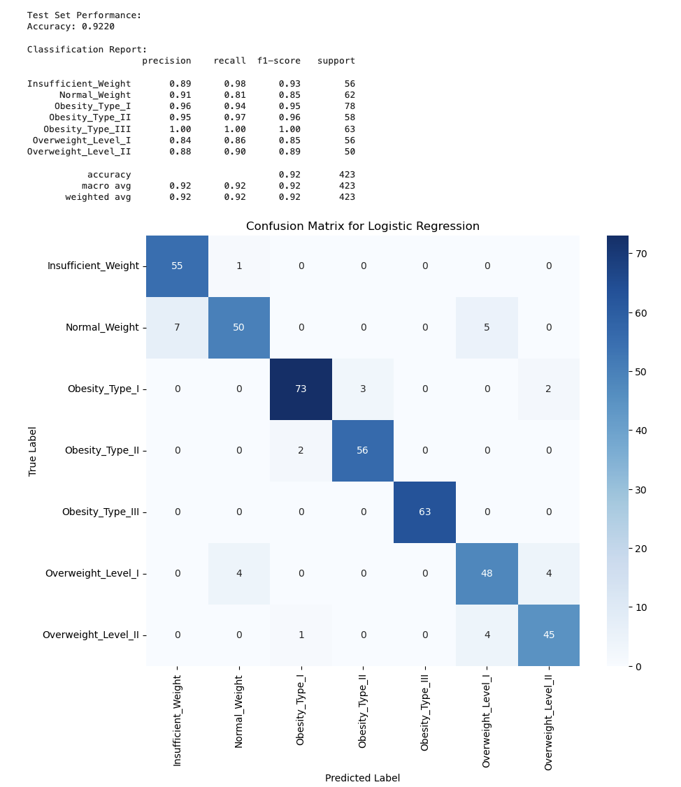

# Obesity Prediction

## The Scale Doesn’t Lie — But Does Our Model?

**Final Report**
Machine Learning · Spring 2025

**Authors**
Nadine Daum · Jasmin Mehnert · Ashley Razo · Nicolas Reichardt

[GitHub repo](https://github.com/nicolasreichardt/ml-project-obesity-prediction)
Submission: 23 May 2025

## Summary

The project "Obesity Prediction: The Scale Doesn't Lie – But Does Our Model?" applies supervised machine learning to classify individuals into obesity risk categories based on biometric and lifestyle data. We implemented and evaluated multiple models (including logistic regression, KNN, tree-based models, and a neural network) using a shared preprocessed dataset to ensure consistent and fair comparison.

Our best-performing models achieved test accuracy scores above 85%, with interpretable insights from tree-based approaches and strong generalization from the neural network.

## Table of Contents

- [Obesity Prediction](#obesity-prediction)
  - [The Scale Doesn’t Lie — But Does Our Model?](#the-scale-doesnt-lie--but-does-our-model)
  - [Summary](#summary)
  - [Table of Contents](#table-of-contents)
  - [Team](#team)
  - [Project Overview](#project-overview)
  - [1. Dataset Description](#1-dataset-description)
    - [Dataset Overview:](#dataset-overview)
    - [EDA findings:](#eda-findings)
  - [2. Preprocessing \& Feature Engineering](#2-preprocessing--feature-engineering)
    - [Preprocessing Goals](#preprocessing-goals)
    - [Key Steps](#key-steps)
    - [Data Preprocessing Summary](#data-preprocessing-summary)
    - [Implementation](#implementation)
  - [3. Model Overviews](#3-model-overviews)
    - [Logistic Regression](#logistic-regression)
      - [Confusion Matrix Explanation](#confusion-matrix-explanation)
      - [Summary](#summary-1)
    - [Ridge Logistic Regression](#ridge-logistic-regression)
      - [Comparing Results: Ridge vs Regular Logistic Regression](#comparing-results-ridge-vs-regular-logistic-regression)
      - [Why Ridge Performed Better:](#why-ridge-performed-better)
      - [Summary](#summary-2)
    - [K-Nearest Neighbors (KNN)](#k-nearest-neighbors-knn)
    - [Encoding Strategy](#encoding-strategy)
    - [Baseline KNN Classifier (No PCA)](#baseline-knn-classifier-no-pca)
    - [KNN with PCA](#knn-with-pca)
    - [KNN with Reduced Feature Set](#knn-with-reduced-feature-set)
    - [Validation on Real-Only Data](#validation-on-real-only-data)
    - [PCA Visualization in 3D](#pca-visualization-in-3d)
    - [Neural Network](#neural-network)
      - [Preprocessing \& Input Data](#preprocessing--input-data)
      - [Training Process](#training-process)
      - [Performance Evaluation](#performance-evaluation)
    - [Tree-Based Models](#tree-based-models)
      - [Decision Tree Classifier](#decision-tree-classifier)
      - [Random Forest Classifier](#random-forest-classifier)
      - [XGBoost Classifier](#xgboost-classifier)
  - [4. Model Comparison](#4-model-comparison)
    - [Model Comparison Overview](#model-comparison-overview)
      - [1. Decision Tree Outperforming Other Models](#1-decision-tree-outperforming-other-models)
      - [2. Uncommon Training/Test Results](#2-uncommon-trainingtest-results)
      - [3. Biometric Features vs. Lifestyle Features](#3-biometric-features-vs-lifestyle-features)
    - [Model Comparison with Feature Exclusion](#model-comparison-with-feature-exclusion)
  - [5. Policy Implications](#5-policy-implications)
  - [6. Reflection](#6-reflection)
  - [Appendix A: Links \& Files](#appendix-a-links--files)

## Team

- Nadine Daum – [GitHub](https://github.com/NadineDaum) | [Email](mailto:n.daum@students.hertie-school.org)
- Jasmin Mehnert – [GitHub](https://github.com/jasmin-mehnert) | [Email](mailto:j.mehnert@students.hertie-school.org)
- Ashley Razo – [GitHub](https://github.com/ashley-razo) | [Email](mailto:a.razo@students.hertie-school.org)
- Nicolas Reichardt – [GitHub](https://github.com/nicolasreichardt) | [Email](mailto:n.reichardt@students.hertie-school.org)

---

## Project Overview

This project aims to classify individuals into seven obesity risk categories based on various biometric and behavioral factors. Using a labeled dataset of 2,111 individuals from Mexico, Peru, and Colombia, our models predict obesity levels ranging from *Insufficient Weight* to *Obesity Type III*.

The goal is to explore how well machine learning models can predict obesity status and how these predictions might support future public health decisions, risk assessment tools, or individual recommendations.

[GitHub repo](https://github.com/nicolasreichardt/ml-project-obesity-prediction)

---

## 1. Dataset Description

We used the **Obesity Levels Estimation Dataset**, which contains demographic, behavioral, and biometric data for 2,111 individuals from Mexico, Peru, and Colombia. The dataset was designed for multi-class classification and is labeled with 7 obesity categories.

### Dataset Overview:

- **Size**: 2,111 samples × 17 features + 1 target
- **Features**: mix of categorical (e.g., gender, transport_mode) and numerical (e.g., height, weight, age)
- **Target variable**: `obesity_level` with 7 classes:
  - Insufficient Weight
  - Normal Weight
  - Overweight Level I
  - Overweight Level II
  - Obesity Type I
  - Obesity Type II
  - Obesity Type III
- **ML relevance**: Multi-class classification task with imbalanced class distribution
- **Input shape for models**: ~43 features after encoding (based on one-hot transformation)

The data was collected via a cross-sectional survey and is publicly available on [Kaggle](https://www.kaggle.com/datasets/ruchikakumbhar/obesity-prediction), supported by this [research article](https://pmc.ncbi.nlm.nih.gov/articles/PMC6710633/).

---

### EDA findings:

📒 Notebook: [`notebooks/EDA.ipynb`](https://github.com/nicolasreichardt/ml-project-obesity-prediction/blob/main/notebooks/EDA.ipynb)

Our EDA revealed several interesting patterns in the dataset. Weight exhibited a strong bimodal distribution and was the most predictive feature for distinguishing obesity levels. As expected, higher weight values were clearly associated with higher obesity categories, while height showed minimal variation across groups.

Among the numerical features, age was slightly right-skewed, with a concentration of younger individuals, and showed a mild upward trend in older age groups within higher obesity levels. Several categorical features (e.g., smokes, calorie_tracking) were imbalanced, while lifestyle-related variables like vegetables_freq and physical_activity_freq displayed greater diversity.

Correlation analysis supported these insights: weight had strong positive correlations with Obesity_Type_I and Obesity_Type_II, and a negative correlation with Normal_Weight. Behavioral factors such as vegetable intake, snacking, and screen time showed moderate correlations, suggesting their relevance when combined in a predictive model.

---

## 2. Preprocessing & Feature Engineering

Before modeling, the dataset required thorough cleaning and transformation.

### Preprocessing Goals

- Ensure consistent input format across models
- Improve model performance and comparability
- Reduce noise, redundancy, and scaling-related bias

### Key Steps

- **Feature selection**: Retained 17 relevant input features capturing diet, behavior, and biometrics
- **Target formatting**: Standardized and renamed the class column to `obesity_level`
- **Encoding**: Applied one-hot encoding to 13 categorical features (e.g., `gender`, `transport_mode`)
- **Scaling**: Used `StandardScaler` to normalize all numerical features (e.g., `age`, `height_m`, `weight_kg`)
- **Output dimensions**: Final input to the models included ~43 encoded features
- **Train/test split**: 80/20 split applied uniformly to ensure fair model evaluation
- **File formats**: Datasets exported as both `.csv` and `.feather` (for faster access)

### Data Preprocessing Summary

The preprocessing pipeline ensured consistency and cleanliness of the dataset ahead of modeling. Initially, inconsistencies in categorical encodings were resolved by harmonizing all variables into either clean categorical or numeric formats. Several ordinal features contained unexpected decimal values, likely due to synthetic oversampling (SMOTE). These were systematically rounded to the nearest valid categories and mapped back to interpretable labels, informed by the original survey structure.

All column names were renamed for clarity and uniformity, and a comprehensive data dictionary was created to document question wording and response options. Categorical features were converted to the appropriate category type, while numerical variables were explicitly cast as floats.

### Implementation

📒 Notebook: [`notebooks/preprocessing.ipynb`](https://github.com/nicolasreichardt/ml-project-obesity-prediction/blob/main/notebooks/preprocessing.ipynb)

All models consumed the same cleaned and scaled training and testing data.

---

## 3. Model Overviews

All models used the same preprocessed data for consistency.

### Logistic Regression

📒 Notebook: [`logistic_regression.ipynb`](https://github.com/nicolasreichardt/ml-project-obesity-prediction/blob/main/notebooks/logistic_regression.ipynb)

To start with a simple baseline, a logistic regression was used to predict obesity levels based on lifestyle and demographic variables.

#### Confusion Matrix Explanation

The confusion matrix shows how well a model's predictions match the actual labels. Some insights from the confusion matrix are:

- Misclassifications are more frequent in the "Normal_Weight" and "Overweight_Level_I/II" classes. The model struggles more with these compared to the obesity types, likely due to class overlap or underrepresentation in the data. This may guide sampling adjustments or weighted loss functions.
- "Insufficient_Weight" has `<strong>`precision (O.89)`</strong>` and very high `<strong>`recall (0.98)`</strong>` meaning the model rarely misclassifies others as this class and identifies it well.
- "Overweight_Level_I" and "Overweight_Level_II" both have `<strong>`lower recall (0.86 and 0.90 respectively)`</strong>` and `<strong>`F-1 scores(~0.85 - 0.89)`</strong>` highlighting weakness in distinguishing between these classes. This may show which predictions you can trust more than others which can be critical in medical contexts.
- Additionally, the confusion between "Normal_Weight" and "overweight_Level_I" suggests features (e.g. calorie tracking or exercise) are not distinctive enough between these classes.

#### Summary

- Best logisitc regression parameters: C = 10, Penalty = L2
- Cross-validation Accuracy: 90.99 %
- Test Set Accuracy: 92.20 %
- Logistic regression performs well across most classes with minor classification in closely related categories (e.g. Overweight I vs II).
- This model provided a simple baseline with good interpretability.

---

### Ridge Logistic Regression

📒 Notebook: [`ridge_logistic_regression.ipynb`](https://github.com/nicolasreichardt/ml-project-obesity-prediction/blob/main/notebooks/ridge_logistic_regression.ipynb)

Next, a regularized version of logisitc regression is used to predict obesity levels based on lifestyle and demographic variables.

#### Comparing Results: Ridge vs Regular Logistic Regression

- `<strong>`Insufficient_Weight `</strong>`: Recall improved from 0.98 -> 1.00
- `<strong>`Normal_Weight `</strong>`: Recall improved from 0.81 -> 0.84, F1 from 0.85 -> 0.90
- `<strong>`Obesity_Type_III `</strong>`: Stayed at a strong 1.00 recall, with a slight boost in precision.
- `<strong>`Overweight Levels `</strong>`: Notably stronger F-1 scores across both levels.
  - Level I: 0.85 -> `<strong>`0.89 `</strong>`
  - Level II: 0.89 -> `<strong>`0.92 `</strong>`

#### Why Ridge Performed Better:

Ridge Logistic Regression adds `<strong>`L2 regularization `</strong>`, which penalizes large coefficient value. This has several benefits:

- `<strong>` Prevents Overfitting `</strong>`: By discouraging large swings in model weights, ridge regularization reduces the chance of the model fitting noise, especially when you have many dummy variables from one-hot encoding.
- `<strong>` Handles Multicollinearity `</strong>`: Since many features in the dataset (e.g. different frequency levels of food/exercises) are likely correlated, ridge helps stabilize the learning process, spreading importance more evenly.
- `<strong>` Improved Generalization `</strong>`: The higher `<strong>` test accuracy (93.6%)`</strong>` suggests the model generalizes better to unseen data due to the smoother decision boundaries.
- `<strong>` Better Weights Sharing Across Classes `</strong>`: Ridge performs well in multi-class classification because it balances the coefficients for all classes simultaneously, unlike logistic regression which can overfit certain classes.

#### Summary

When comparing regular logistic regression and ridge logistic regression on the obesity classification task, we find that ridge achieves a higher test accuracy (93.6% vs. 92.2%) and stronger performance across nearly all classes. This improvement stems from ridge's use of L2 regularization, which penalizes overly large coefficients and mitigates overfitting. This is especially important in high-dimensional settings with many one-hot encoded categorical features. Notably, class-level F1 scores improved in categories like "Normal_Weight" and both "Overweight_Level" classes, suggesting that ridge helped the model better distinguish between closely related classes. Overall, ridge logistic regression offers more robust generalization and smoother class boundaries in this multi-class classification context.

---

### K-Nearest Neighbors (KNN)

📒 Notebook: [`PCA_KNN.ipynb`](https://github.com/nicolasreichardt/ml-project-obesity-prediction/blob/main/notebooks/PCA_KNN.ipynb)

This notebook investigates how dimensionality reduction with Principal Component Analysis (PCA) affects the performance of a K-Nearest Neighbors (KNN) classifier in predicting obesity levels. Four variations of KNN were trained and evaluated:

- A **Baseline KNN Classifier** (with all features, no PCA)
- A **KNN Classifier with PCA**
- A **KNN Classifier on a reduced feature set** (excluding weight, height, and age)
- A **KNN Classifier with PCA excluding SMOTE generated data**

The **best overall test accuracy (0.78)** was achieved **no matter whether we used PCA**. On the full dataset, PCA preserved nearly all variance but did not improve performance over the baseline. The reduced feature model performed significantly worse. Below is a more detailed overview of each approach and its outcomes.

---

### Encoding Strategy

Before model training, a careful encoding approach was applied to ensure distance metrics used by KNN remained meaningful:

- **Binary variables** (e.g., gender, smoking) were mapped to 0 and 1
- **Ordinal variables** (e.g., `vegetables_freq`, `physical_activity_freq`) were encoded using manually defined, meaningful level orderings (e.g., *Never* < *Sometimes* < *Always*)

This ordinal encoding preserved structure while avoiding the sparsity of one-hot encoding. This is particularly important for KNN, as high-dimensionality can dilute the distance signal.

---

### Baseline KNN Classifier (No PCA)

The baseline KNN was trained on all scaled features (excluding `transport_mode`, which had weak correlations with obesity level). The model was tuned via 5-fold cross-validation across values of \( k \). The best model used:

- **k:** 1
- **Test Accuracy:** 0.7754

The high performance at \( k = 1 \) could be explained by the use of SMOTE, which creates synthetic clusters with very tight proximity between samples of the same class. As a result, the nearest neighbor often shares the correct label, while increasing \( k \) introduces less similar neighbors and reduces accuracy.

---

### KNN with PCA

Dimensionality reduction was implemented using a pipeline that included PCA followed by KNN, evaluated using grid search with cross-validation. The best configuration was:

- **k:** 1
- **Number of PCA Components:** 15
- **Test Accuracy:** 0.7754

The number of features got not reduced, therefore PCA preserved all variance from the original data. As a result, model performance remained unchanged. This suggests PCA did not effectively compress the input space.

---

### KNN with Reduced Feature Set

To avoid target leakage, we removed the features weight_kg and height_m, as the target variable (BMI-based obesity level) is directly derived from them via the BMI formula. Including these features would allow the model to trivially reconstruct the label. The final model used:

- **k:** 3
- **Test Accuracy:** 0.5934

This performance drop is expected. However, this version focuses on **modifiable lifestyle variables**, which are more suitable for public health use cases, as they can be self-reported, less privacy sensitive and can be targeted through interventions.

---

### Validation on Real-Only Data

To assess generalizability, the model was re-evaluated on a 23% subset of non-synthetic data. The best KNN+PCA model achieved:

- **k:** 1
- **Number of PCA Components:** 15
- **Test Accuracy:** 0.8763

This confirms that PCA can be effective in real-world scenarios, helping to reduce noise and correlation while preserving essential structure.

---

### PCA Visualization in 3D

A 3D PCA plot was generated using the first three components. Original features were projected as black arrows to indicate their influence on component directions. Visual inspection showed:

- Features like **vegetables_freq** and **physical_activity_freq** pointed toward key directions of variation
- Moderate separation of obesity classes was visible, especially for **extreme categories like Obesity_Type_III**
- PCA successfully reduced redundancy and improved interpretability of the input space

---

### Neural Network

📒 Notebook: [`neural_network.ipynb`](https://github.com/nicolasreichardt/ml-project-obesity-prediction/blob/main/notebooks/neural_network.ipynb)

This notebook implements a multi-layer feedforward neural network for classifying individuals into one of seven obesity categories. The model was built using Keras with a TensorFlow backend and trained on the shared, preprocessed dataset.

#### Preprocessing & Input Data

Neural networks require all inputs to be numeric and appropriately scaled. To meet this requirement:

- Categorical variables were **one-hot encoded**, resulting in binary columns representing each category. This expanded the feature space to approximately 43 input dimensions.
- Numerical features such as `age`, `height_m`, and `weight_kg` were **standardized using `StandardScaler`**, which centers the data and scales to unit variance.

The model architecture consisted of:

- Two fully connected hidden layers with **ReLU activation**
- **Dropout layers (rate: 0.3)** for regularization
- A **softmax output layer** for multi-class classification (7 classes)

The model was trained using:

- **Loss function**: `categorical_crossentropy`
- **Optimizer**: `Adam`
- **Epochs**: 50
- Target: one-hot encoded labels for `obesity_level`

#### Training Process

The model was trained on the shared training set (`train_data.feather`) and evaluated on the standard test set. The training history showed stable convergence of both loss and accuracy, with validation metrics closely tracking the training metrics:

No signs of overfitting were observed, likely due to dropout regularization and standardized inputs.

#### Performance Evaluation

The neural network achieved a **test accuracy of 83.9%**, making it one of the best-performing models in the overall comparison.

Class-level performance was assessed using a confusion matrix:

The model showed strong predictive ability across most classes, with misclassifications primarily occurring between adjacent categories (e.g., Normal Weight and Overweight Level I/II). Performance was especially strong in more distinct categories such as Obesity Type III and Insufficient Weight.

- **Strengths**:

  - Stable training and generalization to unseen data
  - Accurate classification across all seven categories
  - Effective in capturing non-linear relationships in the data
- **Limitations**:

  - Requires extensive preprocessing (encoding and scaling)
  - Less interpretable than linear or tree-based models
  - Sensitive to architecture and hyperparameter choices

---

### Tree-Based Models

📒 Notebook: [`tree-based-models.ipynb`](https://github.com/nicolasreichardt/ml-project-obesity-prediction/blob/main/notebooks/tree-based-models.ipynb)

This notebook investigated the use of tree-based machine learning models to classify obesity levels in individuals. Three models were trained and evaluated:

- A **Baseline Decision Tree Classifier**
- A **Random Forest Classifier**
- An **XGBoost Classifier**

The best overall test accuracy was achieved by the **Baseline Decision Tree**, with a score of **0.9611**. The **XGBoost Classifier** followed closely with a test accuracy of **0.9574**. The **Random Forest Classifier** achieved a test accuracy of **0.936**. These results show that all three models performed exceptionally well. Below is a more detailed overview of each model and its outcomes.

---

#### Decision Tree Classifier

The Decision Tree model was trained using a pipeline that incorporated preprocessing and grid search for hyperparameter tuning. The best model used:

- **Criterion:** Entropy
- **Max Depth:** 15
- **Min Samples Split:** 2
- **Min Samples Leaf:** 1

This configuration produced a **cross-validation accuracy of 0.9479** and a **test accuracy of 0.9611**, suggesting that the model generalized very well to unseen data — to an extent that even outperformed its validation score, which is atypical and discussed further in the comparison section.

In terms of feature importance, **biometric features** dominated the predictions:

- **Weight**: 0.625
- **Height**: 0.197

Lifestyle-related features such as “high caloric food intake” played a significantly lesser role.

---

#### Random Forest Classifier

The Random Forest model was also trained using a pipeline with preprocessing and 5-fold cross-validation. The optimal configuration from grid search was:

- **Max Depth:** 20
- **Number of Estimators:** 200
- **Max Features:** 'sqrt'
- **Min Samples Leaf:** 1
- **Min Samples Split:** 2

With these settings, the model achieved a **cross-validation accuracy of approximately 0.935** and a **test accuracy of 0.936**. These results again indicate good generalization with very similar performance on both validation and test sets.

The feature importances mirrored those found in the Decision Tree model. **Weight, height, age, and gender** were the top features, while lifestyle-related variables (e.g., "vegetables_freq") had relatively low importance.

---

#### XGBoost Classifier

Disclaimer:

1. XGBoost models can be computationally intensive, especially when using an extensive parameter grid and k-fold cross-validation. Our team experienced computational issues running the models under certain specifications. Therefore, both the n_jobs argument in XGBClassifier (see pipeline) and in GridSearchCV are set to 1. Feel free to change this argument depending on your device's computational power (setting it to -1 will use all available CPU cores).
2. Because of changes in the scikit-learn and XGBoost APIs over time, there is a version incompatibility between scikit-learn and the most recent version of XGBoost. As previously stated, it is necessary to use scikit-learn==1.5.2, as specified in the requirements.txt.

The XGBoost model was also trained using a pipeline with preprocessing and 5-fold cross-validation. The best model parameters were:

- **Learning Rate:** 0.2
- **Max Depth:** 3
- **Number of Estimators:** 200

This configuration resulted in the **highest cross-validation accuracy of 0.9668**, indicating that the model fit the training data extremely well. However, the **test accuracy dropped slightly to 0.9574**, just below the baseline Decision Tree model.

Interestingly, the XGBoost model’s feature importances showed a different pattern:

- Top features included **"female gender"** and **"weight"**
- Lifestyle-related variables like **"high caloric food frequency," "alcohol consumption frequency,"** and **"snacking frequency"** appeared in the top five
- **"Height"** was notably absent from the most important predictors

The following section will compare and offer an interpretation of these results and the feature importances.

---

## 4. Model Comparison

| Model                     | Test Accuracy | Notes                                  |
| ------------------------- | ------------- | -------------------------------------- |
| Logistic Regression       | 92.2%         | Simple, interpretable                  |
| Ridge Logistic Regression | 93.6%         | Slight improvement with regularization |
| KNN                       | 77.54%        | Better with PCA                        |
| Neural Network            | 83.9%         | Strong generalization                  |
| Baseline Decision Tree    | 96.45%        | Best-performing model                  |
| Random Forest             | 93.62%        | Weakest tree-based model               |
| XGBoost                   | 95.74%        | Unexpected feature importances         |

We will now compare our three best-performing models:

- The **Baseline Decision Tree Classifier**,
- the **Random Forest Classifier** and
- the **XGBoost Classifier**.

### Model Comparison Overview

Let's first remind ourselves of the test accuracy of our three models with the following plot.

#### 1. Decision Tree Outperforming Other Models

In the plot above, we observed that our **baseline Decision Tree classifier** outperformed the more complex models—**Random Forest** and **XGBoost**. Nevertheless, all three models performed exceptionally well in terms of accuracy.

The superior performance of the Decision Tree is not entirely surprising. The relationship between the features and the target variable appears to be relatively simple, allowing for decision boundaries that can be effectively captured by straightforward, rule-based splits. This is particularly true for the predictors **"weight"** and **"height"**, which directly influence the target variable.

As discussed further in the feature importance section, both **height** and **weight** are used to compute the **Body Mass Index (BMI)**, which forms the basis for the obesity classification labels in our target variable. Consequently, these features hold a dominant predictive influence.

While Decision Trees are designed to select and split on features based on their immediate predictive power, **Random Forests** and **XGBoost** attempt to model more complex, non-linear interactions among features. This added complexity may actually reduce their performance in a task where a few features dominate the predictive signal. This could explain why our simpler Decision Tree model outperformed the more advanced ensemble methods in this particular case.

#### 2. Uncommon Training/Test Results

We observed very high testing accuracy and high training/validation accuracy across all three models. In the **Decision Tree Classifier** and **Random Forest Classifier**, the test accuracy was even higher than the training/validation accuracy—an outcome that is quite uncommon and unexpected.

Based on these results, we can exclude the possibility that our models were overfitting. However, this pattern revealed two important issues within the dataset:

1. **Target Leakage via BMI-Related Features**
   As previously discussed, the target variable—obesity level—is derived directly from the **Body Mass Index (BMI)**, which is itself calculated using the features **"height"** and **"weight."** Including these features in the model introduced a direct link between inputs and the target, thereby inflating the predictive performance. In essence, the models were not discovering latent behavioral patterns, but rather reverse-engineering the BMI classification from the variables used to compute it.
2. **Synthetic Data and Non-Independent Splits**
   A significant portion of the dataset—approximately **77%** of the records—was synthetically generated using the **SMOTE algorithm** to address class imbalance. While SMOTE is effective at improving model robustness, it creates synthetic samples that are interpolated from existing ones. As a result, the **training and test sets are not entirely independent**, which likely reduced the challenge of the prediction task. This may explain why the test set performance matched—or even slightly exceeded—the training/validation accuracy.

These factors highlight potential limitations in model evaluation and suggest caution when interpreting the performance metrics at face value.

#### 3. Biometric Features vs. Lifestyle Features

Now, we can compare the feature importances of our three models. Let's remind ourselves of the most important features for each model with the following table.

As highlighted in the individual model analyses, biometric features such as **weight**, **height**, **age**, and **gender** consistently emerged as the most important predictors across all three models. These variables were especially dominant in the Decision Tree and Random Forest models, where they significantly outweighed lifestyle-related variables in their contribution to model accuracy.

However, it is precisely the **lifestyle features**—such as dietary habits, physical activity, alcohol consumption, and snacking frequency—that are of greatest interest from a **public health and policy perspective**. Understanding the influence of these modifiable behaviors is essential for designing effective interventions to combat rising global obesity rates. Unfortunately, their predictive power was masked in the initial models by the overwhelming influence of weight and height, which are used to compute BMI—the very basis of the obesity classification used as our target label.

This creates a **circular relationship** in the model: we use BMI to define obesity levels, and then predict those levels primarily using the features from which BMI is derived. To break this dependency and gain a more policy-relevant understanding of behavioral factors, we re-ran all three models—Decision Tree, Random Forest, and XGBoost—excluding the **weight** and **height** predictors. The results are shown below (in the feature exclusion section).

It is also notable that the **XGBoost model’s feature importance rankings** differed significantly from those of the Decision Tree and Random Forest models, even in the full-feature setting. Specifically, features such as **"height"** and **"age"** were **not** among the top predictors in XGBoost, despite being highly ranked in the other two models. This discrepancy is likely due to how these algorithms handle **correlated or redundant features**.

### Model Comparison with Feature Exclusion

As expected, removing the "height" and "weight" features caused a significant drop in model performance. The baseline Decision Tree's accuracy decreased from 0.965 to 0.716, the Random Forest's dropped from 0.936 to 0.79, and the XGBoost model fell from 0.957 to 0.79. These reductions limited the models' accuracy and practical utility.

Notably, both the Random Forest and XGBoost models achieved identical test accuracy. After verifying data splits, preprocessing, and label encodng, we showed that although their overall accuracy was the same, the models made different individual predictions and exhibited distinct class-level behavior. For more details, please visit the tree-based notebook.

Other lifestyle factors, such as "snacking frequency," "vegetable intake," and "physical exercise," showed some predictive power for obesity classes. However, their predictive ability was way lower than that of height and weight in our previous models.

---

## 5. Policy Implications

As already discussed in the comparison section, our models are not well suited for making policy recommendations. While the project originally aimed to explore behavioral and biometric factors contributing to obesity levels, it became clear that the most predictive features (weight and height) are the very inputs used to compute the label itself (BMI class). Removing these features caused model performance to drop significantly, but did not reveal meaningful alternative predictors. This suggests that our models, much like the label, rely heavily on BMI-related inputs.

To better understand this, we revisited the original [paper](https://www.ncbi.nlm.nih.gov/pmc/articles/PMC6710633/) by De-La-Hoz-Correa, Mendoza-Palechor, and De-La-Hoz-Franco (2019), which introduced the dataset. Their goal was to build a digital tool that could classify obesity levels more efficiently using models like J48 Decision Trees and Naïve Bayes. However, their approach (and ours, by necessity) ends up replicating a BMI calculator: the model receives weight and height as input, and then “predicts” a BMI category that is literally derived from those same inputs.

In practice, this means the tool and our models do not provide additional value beyond what a simple calculator could offer. From a policy perspective, this approach is of limited use: it can't help identify modifiable behaviors, socio-economic risk factors, or intervention targets.

A more useful tool would aim to:

- Exclude BMI-defining inputs like weight and height
- Focus on behavioral, psychological, or socio-demographic data
- Predict long-term health outcomes or obesity risk, not BMI class alone

Such an approach would be better suited for identifying at-risk populations, guiding prevention efforts, and shaping public health policy (especially in contexts where biometric data is unavailable).

---

## 6. Reflection

This project came with both strengths and challenges. One of our biggest strengths was working collaboratively on a consistent preprocessing pipeline: ensuring that all models used the same cleaned data, feature encodings, and train/test split. This made comparison between models much more reproducible.

That said, we also faced several challenges. Data imbalance, model tuning, and choosing the right evaluation metrics required careful attention. But tackling these difficulties helped us deepen our understanding of model behavior, especially in multi-class classification tasks.

Perhaps the most important lesson we learned was this: spend more time up front investigating your dataset. Understanding how features are constructed (and whether the target variable is derived from other inputs) can drastically affect your entire modeling strategy. In our case, we were aware that the dataset included synthetically generated samples (via SMOTE), but we only fully grasped the consequences when we saw how dominant height and weight were in determining the label. It was during model training and evaluation that we realized the original goal (modeling behavioral drivers of obesity) was not feasible with this dataset.

Looking ahead, future improvements could include validating our models on a real-world dataset that wasn’t artificially constructed, ideally with health outcomes beyond BMI. It would also be interesting to explore unsupervised methods or clustering to understand lifestyle patterns, especially if labels are noisy or questionable.

Overall, this project gave us hands-on experience with a full supervised machine learning workflow and reminded us that technical performance isn’t everything: context and critical thinking matter just as much.

---

## Appendix A: Links & Files

- **GitHub Repository**: [nicolasreichardt/ml-project-obesity-prediction](https://github.com/nicolasreichardt/ml-project-obesity-prediction)
- **Cleaned dataset (CSV)**: `processed_data/obesity_cleaned.csv`
- **Train/Test files**:
  - `processed_data/train_data.feather`
  - `processed_data/test_data.feather`
- **Model notebooks**: in `notebooks/`
- **Generated plots**: in `plots/`
